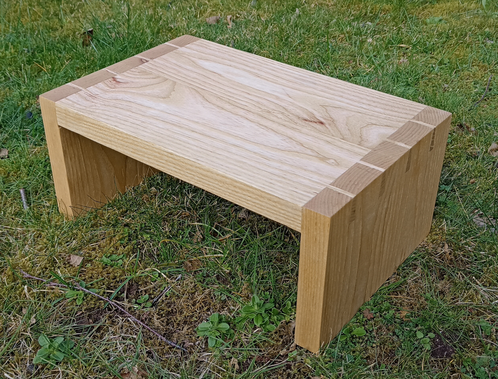
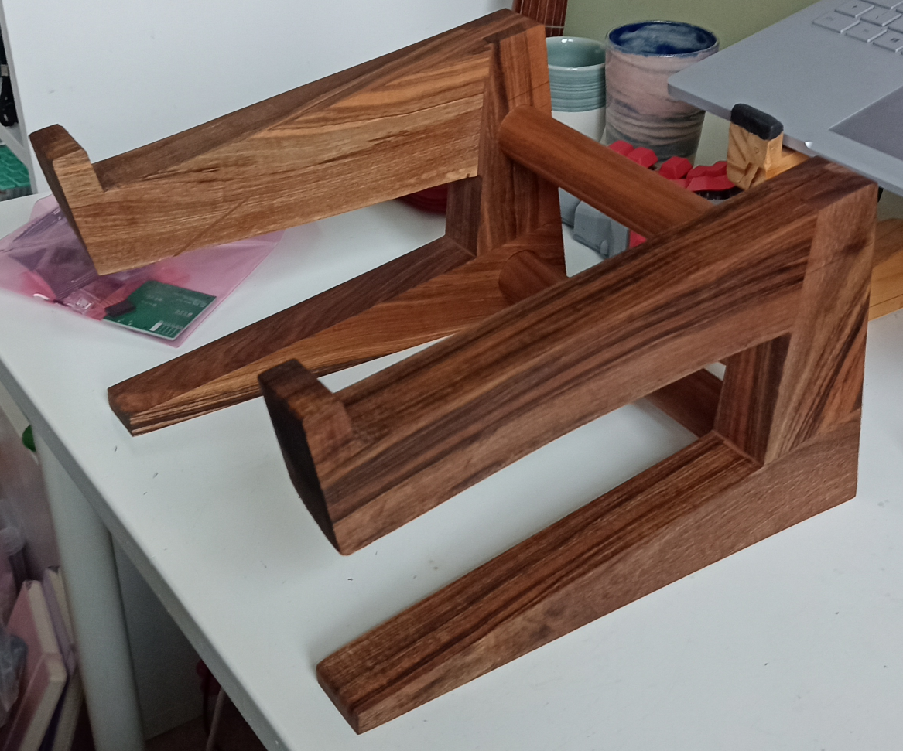

# Woodworking

Since the COVID lockdowns I've been getting into woodworking as a way to get away from my computer and these have been a couple of my projects.

## Monitor / Laptop Stands

Since playing around with some ergonomics and learning about keybords I realised how bad most monitors are for customisation and height adjustment. Most basic ones don't actually go up to the "correct" height for most people so I decided to make some monitor stands to raise them up to a good height. Similarly, people who have laptops as their work computer end up with them on the desk rather than raising them up to a good eye level.

Most of them I've given away to colleagues or people at the hackspace, asking for donations to charity as a thank you. They allow me to practice my joinery rather than just making joints which is a bit of a waste of wood.

### Basic Dovetail

This was a laptop stand for a colleague, they were using a box to raise their laptop up but I thought this would look a little nicer.

There were some mistakes with the dovetails but it was a good learning experience, especially trying to correct said mistakes. Overall pretty happy, and my colleague was as well.

### Walnut Live Edge Laptop Stand

This was an experiment to use up some scrap from another project and I was really happy. I made one or two mistakes cutting the wrong part on the bandsaw but the way the live edges work on the bottom of the laptop arm is a nice touch. I liked adding a bowtie inlay even though I think it was a little unnecessary.

I had previously made a stand similar to this out of a single piece of wood, but it suffered from a critical problem in that the grain direction created weaknesses that could lead to failuure. This way is a little more messy but isn't weak.